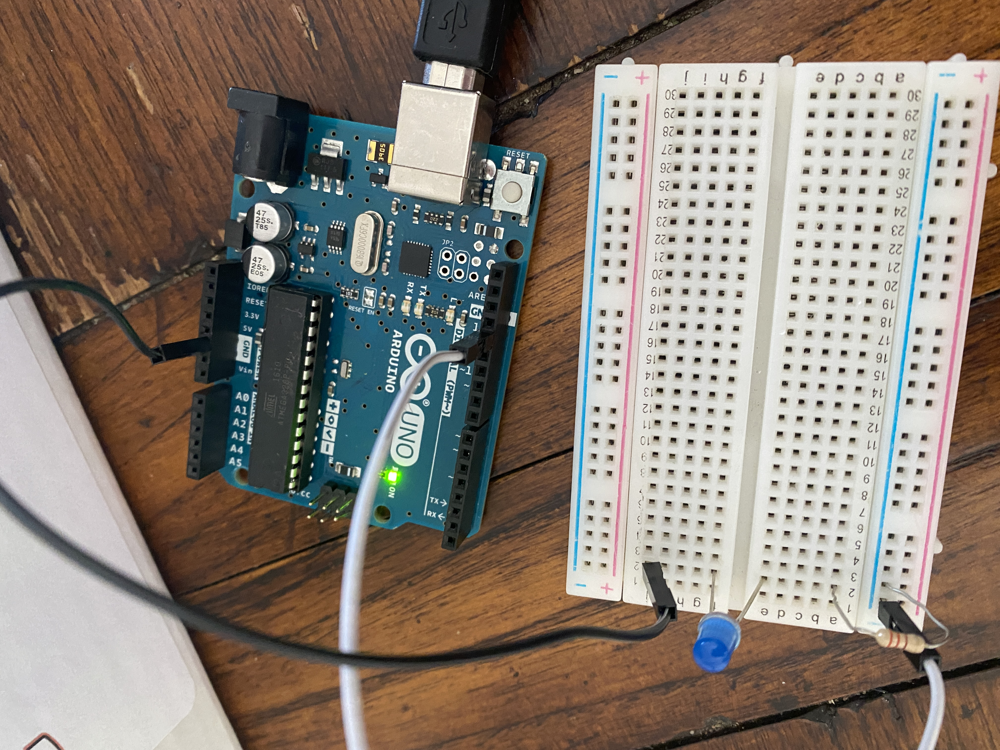
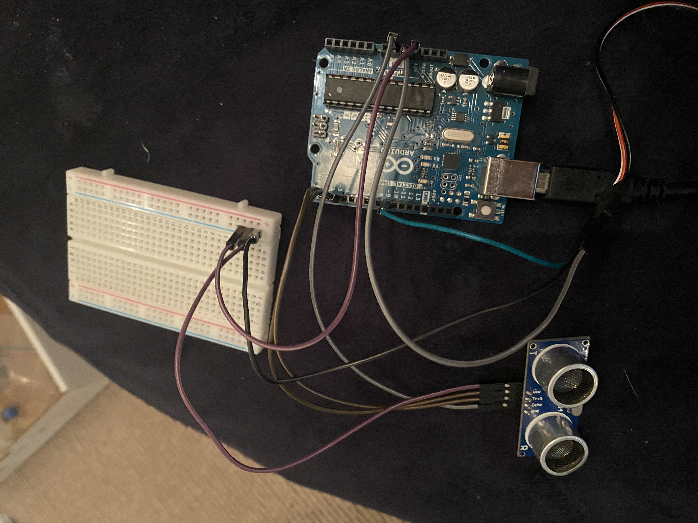

# NotSoBasicArduino

We are learning to code using an Arduino Uno.

## LEDBlinkRevisited

### Description

I took two wires with male ends. I plugged one end of the first wire into the GND port on the arduino and the other end into e1 on the bread board. For the second wire, I plugged one end into the number 9 spot on the arduino and the other end into j2 on the bread board. I then took a resistor and plugged it into e2 and g2. I took the LED light and plugged the longer end into a1 and the shorter end into a2. I took the hdmi cord and plugged it into my computer. From there, I went into the examples tab in Arduino Create and downloaded the "fade" example. I messed around with how fast it faded and it worked!

### Evidence
[The Code in Arduino Create](https://create.arduino.cc/editor/qragsda80/6c9ae5f0-c886-4ab2-83a6-765d254922f4)

### Image

### Reflection

This was my first arduino module in Arduino Create. I liked coding, but I think 3D designing is more fun. I feel like I can be more creative that way. I will probably be doing the 3D designing part for the final project. I messed around with the speed of the fade and put it up to 5,000. I took a video in slo-mo and it looked really cool. I had fun with this assignment.

---

## FiniteLEDBlinker

### Description

I took two wires with male ends. I plugged one end of the first wire into the GND port on the arduino and the other end into j2 on the bread board. For the second wire, I plugged one end into the number 13 spot on the arduino and the other end into -1 on the bread board. I then took a resistor and plugged it into -2 and a2. I took the LED light and plugged the longer end into e2 and the shorter end into f2. I took the hdmi cord and plugged it into my computer. Mr. Dierold helped me with the code in class and got it working!

### Evidence

[The Code in Arduino Create](https://create.arduino.cc/editor/qragsda80/fa547014-0cb0-4aa7-876a-1614689c5f34)

### Image

### Reflection

I'm trying to get these assignments done fast, so that I can get started on the partners ultrasonic senser project. I'm almost done with the next assignment right now, but I have to get them into Github. This is probably the longest part. I am having fun making these assignments, though. Seeing something that I made work makes learning so much more fun!

---

## HelloFunctions

### Description

In this assignment, I connected four wires from the ultrasonic sensor to the ~3, the 2, the GND, and the +2 spot on the bread board. For the motor, I connected those three wires to the ~9, the GND, and the +3 on the bread board. Finally, I connected one wire from the 5V spot to the +1 spot on the bread board. The bread board made it possible for me to connect both of the servos to the 5V spot that they need to work. Me and Elias worked on the code together. We found normal codes for the ultrasonic sensor and motor and put the together. Mr. Dierolf helped us clean up our coding and figure out some difficulties.

### Evidence

[The Code in Arduino Create](https://create.arduino.cc/editor/qragsda80/39baeb1a-4dc6-44a3-940b-1b0cdf69dd07)

### Image

### Reflection

I'm am running low on time for these last few projects. I've finished this one, "New Ping," and almost done with "Photoresistor." I just need to put in them into github and submit. I will finish the githubs tomorrow and have them in before make-up work is due for the semester. I wish I put aside more time for these assignments because they are fun, but it's not as fun when you are stressing to finsih in time. Aside from the struggles, this assignment turned out really well and I thought it was fun to make. This should be very similar to our project

---

## NewPing

### Description

### Evidence

[The Code in Arduino Create]()

### Image

### Reflection

---

## Photoresistor

### Description

### Evidence

[The Code in Arduino Create]()

### Image

### Reflection

---

